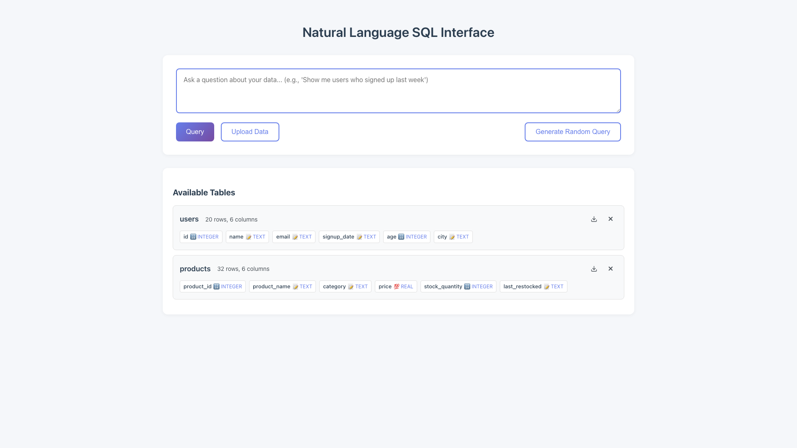
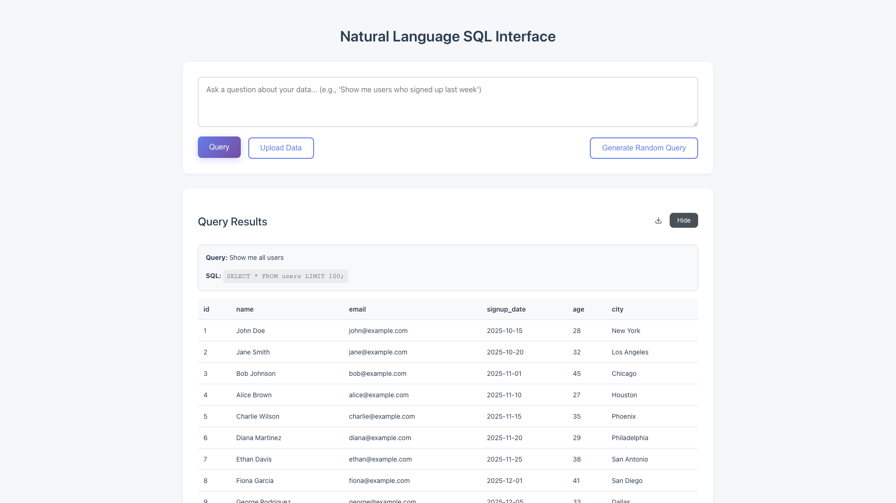

# One-Click Table & Query Result Exports

**ADW ID:** 46199b73
**Date:** 2026-06-20
**Specification:** specs/issue-1-adw-46199b73-sdlc_planner-one-click-table-exports.md

## Overview

Adds one-click CSV export capability to the Natural Language SQL Interface. Users can now download any table's full contents or the most recent query's result set as a `.csv` file directly from the UI, without copy-pasting or re-querying.

## Screenshots





## What Was Built

- `GET /api/export/table/{table_name}` — exports any uploaded table as a downloadable CSV
- `POST /api/export/query` — re-executes a SQL string and returns the result set as a downloadable CSV
- Download icon button on every Available Tables row, placed directly left of the `×` remove button
- Download icon button in the Query Results header, placed directly left of the Hide/Show toggle button
- `rows_to_csv` helper on the server for converting row dicts to CSV using Python's standard `csv` module
- `downloadFile` / `parseFilename` helpers on the client for fetch-to-blob browser downloads
- E2E test file `.claude/commands/e2e/test_table_exports.md`
- Server unit tests in `app/server/tests/core/test_export.py`

## Technical Implementation

### Files Modified

- `app/server/server.py`: Added `rows_to_csv` helper and two new FastAPI endpoints (`GET /api/export/table/{table_name}`, `POST /api/export/query`)
- `app/server/core/data_models.py`: Added `QueryExportRequest` Pydantic model with `sql: str` field
- `app/client/src/api/client.ts`: Added `parseFilename`, `downloadFile` helpers and `exportTable`, `exportQueryResults` API methods
- `app/client/src/main.ts`: Added `lastQuerySql` state, `DOWNLOAD_ICON_SVG` constant, `exportTable`/`exportQueryResults` wrappers, and download buttons in `displayTables` and `displayResults`
- `app/client/src/style.css`: Added `.table-actions`, `.results-actions` flex containers and `.download-table-button`, `.download-results-button` icon button styles
- `app/client/src/types.d.ts`: Added `QueryExportRequest` interface
- `README.md`: Added new endpoints to the API Endpoints section
- `app/server/tests/core/test_export.py`: New server unit tests for CSV helper and both endpoints
- `.claude/commands/e2e/test_table_exports.md`: New E2E test file

### Key Changes

- **Security reuse**: both endpoints route through the existing `validate_identifier` / `execute_query_safely` / `execute_sql_safely` helpers — no new SQL injection surface is introduced
- **Re-execute for query export**: rather than posting the rendered result array, the client sends only the SQL string which the server re-executes through `execute_sql_safely`; keeps the payload minimal and reuses the tested security layer
- **Blob download pattern**: the client uses `fetch → response.blob() → URL.createObjectURL → <a>.click()` to trigger a browser file download without a full page navigation; the object URL is revoked immediately after the click
- **Button placement via flex containers**: `.table-actions` and `.results-actions` `div` wrappers group the download + action buttons so they stay adjacent even when the parent uses `space-between` layout
- **Download icon**: inline SVG (downward arrow into a tray) with `currentColor` so the icon inherits hover/focus color from CSS without extra assets

## How to Use

### Export a Table

1. Upload a file or load sample data — the table appears under **Available Tables**.
2. Click the download icon button (directly left of the `×` button) on the target table row.
3. The browser downloads `<table_name>.csv` containing the full table contents.

### Export Query Results

1. Run a natural language query — results appear in the **Query Results** section.
2. Click the download icon button in the results header (directly left of the **Hide** button).
3. The browser downloads `query_results.csv` containing the displayed result rows.

> The results download button is only visible when there are rows to export (no error and `row_count > 0`).

## Configuration

No new environment variables or configuration options are required. The feature uses:
- Python standard-library `csv` and `io` modules (no new dependencies)
- `fastapi.responses.Response` (already available via FastAPI)

## Testing

```bash
# Server unit tests (includes new export tests)
cd app/server && uv run pytest

# Confirm SQL injection protections still pass
cd app/server && uv run pytest tests/test_sql_injection.py -v

# Frontend type check
cd app/client && bun tsc --noEmit

# Frontend build
cd app/client && bun run build

# E2E test
# Run /test_e2e with .claude/commands/e2e/test_table_exports.md
```

## Notes

- **Empty tables / zero-row queries**: the export still produces a valid CSV (header row only) and does not error.
- **Special characters in values**: the standard `csv.DictWriter` handles commas, quotes, and newlines in cell values via RFC 4180 quoting.
- **Invalid identifiers / dangerous SQL**: rejected with `400` before any SQL is executed, consistent with existing endpoint behavior.
- **Future considerations**: streaming export via `StreamingResponse` with a generator for very large tables; export-format options (JSON, Excel); a "download all tables" bulk action.
